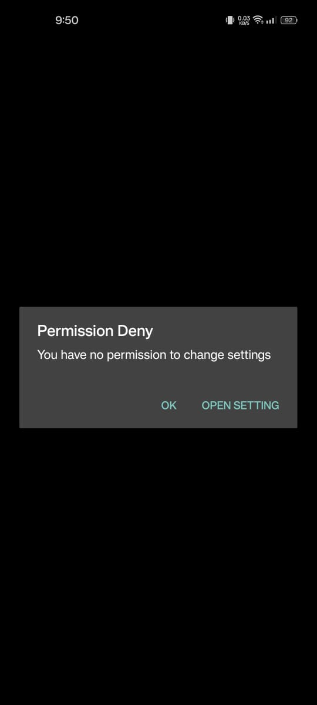
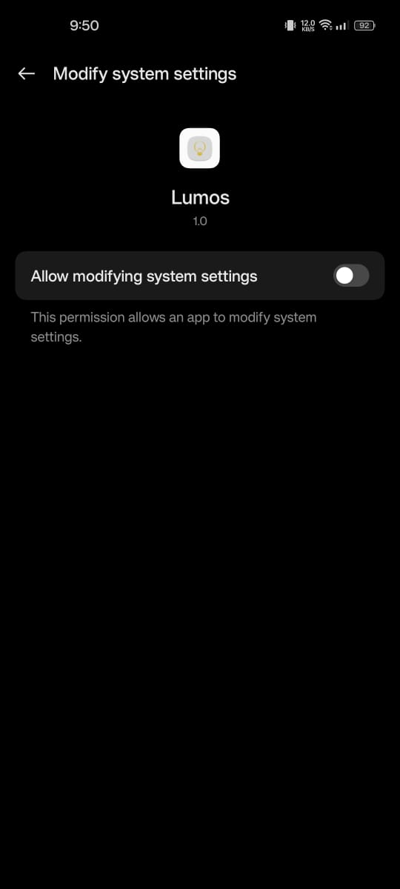

# 🌟 Lumos

**Lumos** is my take on a super simple React Native app that cranks your device's screen brightness to max the moment you open it. Once the brightness is set, the app gracefully bows out. If it runs into permission issues, it’ll nudge you to grant the necessary access. No fuss, no muss.

---

## ✨ What It Does

- 🔆 Blasts screen brightness to 100% on launch
- 🚪 Quits automatically after doing its job
- 🔐 Politely asks for permissions if needed
- 🖐️ Adds a subtle haptic buzz for that extra polish

---

## 📥 Download and Install

Want to try Lumos without building it? Grab the latest APK from the [Releases](https://github.com/YashvardhanShekhar/Lumos/releases/tag/v1.0.0) page.

1. **Download the APK**:
   - Visit the [Releases](https://github.com/YashvardhanShekhar/Lumos/releases) section and download `lumos-release.apk`.
2. **Enable Unknown Sources**:
   - On your Android device, go to **Settings > Security** and enable **Install Unknown Apps** for your browser or file manager.
3. **Install**:
   - Open the APK file and tap **Install**.
4. **Launch**:
   - Open Lumos from your app drawer and enjoy the brightness boost!

**Note**: If you see installation warnings, ensure the APK is signed (see [Android Signing Guide](https://developer.android.com/studio/publish/app-signing)).
---

## 🛠️ Built With

I leaned on these awesome React Native packages to make Lumos happen:

- `react-native-exit-app` – Handles the app’s smooth exit
- `react-native-haptic-feedback` – Gives that satisfying tactile vibe
- `react-native-system-setting` – Manages brightness like a pro

---

## 🚀 Getting Started

Here’s how to get Lumos up and running on your machine:

1. **Clone the repo**:

   ```bash
   git clone https://github.com/your-username/lumos.git
   cd lumos
   ```

2. **Install dependencies**:

   ```bash
   npm install
   ```

3. **Link native modules** (only if you’re using an older React Native version):

   ```bash
   npx react-native link
   ```

4. **Fire it up**:

   ```bash
   npx react-native run-android
   # or
   npx react-native run-ios
   ```

---

## 🔍 How It Works

Lumos is straightforward:

1. On launch, it checks if it has permission to tweak your device’s brightness.
2. If it’s all good:
   - Cranks brightness to max
   - Sends a quick haptic pulse
   - Exits the app like a ninja
3. If permissions are missing:
   - Prompts you to grant access through system settings

---

## 📸 Screenshots






---

## 💡 Why I Built It

I wanted a no-nonsense app that does one thing well—max out brightness instantly. Whether you’re squinting in sunlight or just need a quick brightness boost, Lumos has your back. Plus, I had fun playing with React Native and haptic feedback to make it feel snappy.

---

## 🙏 Shoutouts

Big thanks to the folks behind these open-source libraries. They made my life way easier:

- react-native-exit-app
- react-native-haptic-feedback
- react-native-system-setting

---

## 📝 Notes

- Make sure to test on a physical device, as some emulators might not handle brightness settings or haptics perfectly.
- If you run into permission issues, double-check your device’s settings for system access.

Happy brightening! 🌞
